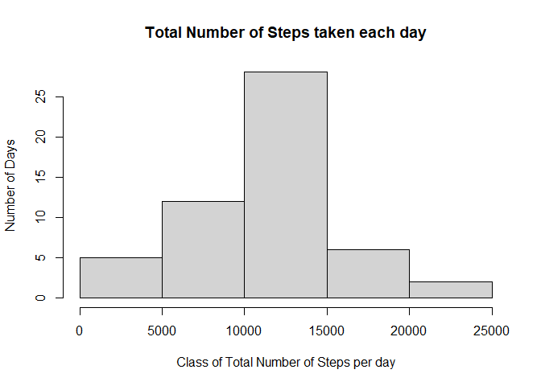
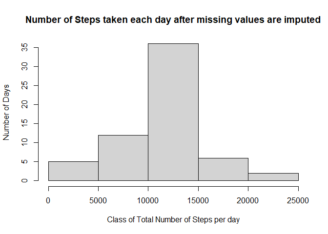
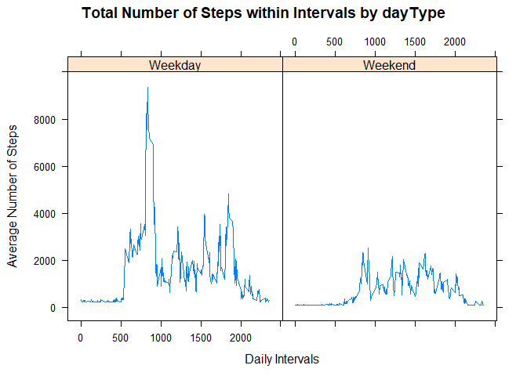

## Loading and preprocessing the data


```r
if(!file.exists("getdata-projectfiles-UCI HAR Dataset.zip")) {
        temp <- tempfile()
        download.file("http://d396qusza40orc.cloudfront.net/repdata%2Fdata%2Factivity.zip",temp)
        unzip(temp)
        unlink(temp)
}

activity<-read.csv("activity.csv")
head(activity)
```

```
##   steps       date interval
## 1    NA 2012-10-01        0
## 2    NA 2012-10-01        5
## 3    NA 2012-10-01       10
## 4    NA 2012-10-01       15
## 5    NA 2012-10-01       20
## 6    NA 2012-10-01       25
```

## What is mean total number of steps taken per day?


```r
totalStepsByDay<-aggregate(steps~date, activity, sum)

hist(totalStepsByDay$steps, xlab="Class of Total Number of Steps per day", ylab="Number of Days", main="Total Number of Steps taken each day")
```

<!-- -->

```r
mean_raw<-mean(totalStepsByDay$steps)
mean_raw
```

```
## [1] 10766.19
```

```r
median_raw<-median(totalStepsByDay$steps)
median_raw
```

```
## [1] 10765
```


## What is the average daily activity pattern?


```r
averageStepsbyInterval<-aggregate(steps~interval, activity, mean)

with(averageStepsbyInterval, plot(interval, steps, type = "l"))
```

<!-- -->

```r
averageStepsbyInterval[which.max(averageStepsbyInterval[,2]),1]
```

```
## [1] 835
```


## Imputing missing values


```r
missingIndex<-is.na(activity[,1])

m<-mean(averageStepsbyInterval$steps)

activity1<-activity
activity1[missingIndex,1]<-m
head(activity1)
```

```
##     steps       date interval
## 1 37.3826 2012-10-01        0
## 2 37.3826 2012-10-01        5
## 3 37.3826 2012-10-01       10
## 4 37.3826 2012-10-01       15
## 5 37.3826 2012-10-01       20
## 6 37.3826 2012-10-01       25
```

```r
totalStepsByDay1<-aggregate(steps~date, activity1, sum)
hist(totalStepsByDay1$steps, xlab="Class of Total Number of Steps per day", ylab="Number of Days", main="Number of Steps taken each day after missing values are imputed")
```

<!-- -->

```r
totalStepsByDay1<-aggregate(steps~date, activity1, sum)

mean_afterImput<-mean(totalStepsByDay1$steps)
mean_afterImput
```

```
## [1] 10766.19
```

```r
median_afterImput<-median(totalStepsByDay1$steps)
median_afterImput
```

```
## [1] 10766.19
```


## Are there differences in activity patterns between weekdays and weekends?


```r
activity1$date<-as.Date(activity1$date)
library(dplyr)
```

```
## 
## Attaching package: 'dplyr'
```

```
## The following objects are masked from 'package:stats':
## 
##     filter, lag
```

```
## The following objects are masked from 'package:base':
## 
##     intersect, setdiff, setequal, union
```

```r
activity2<-activity1%>%
        mutate(dayType= ifelse(weekdays(activity1$date)=="Saturday" | weekdays(activity1$date)=="Sunday", "Weekend", "Weekday"))
head(activity2)
```

```
##     steps       date interval dayType
## 1 37.3826 2012-10-01        0 Weekday
## 2 37.3826 2012-10-01        5 Weekday
## 3 37.3826 2012-10-01       10 Weekday
## 4 37.3826 2012-10-01       15 Weekday
## 5 37.3826 2012-10-01       20 Weekday
## 6 37.3826 2012-10-01       25 Weekday
```

```r
averageStepByDayTypeAndInterval<-activity2 %>%
  group_by(dayType, interval) %>%
  summarize(averageStepByDay=sum(steps))
```

```
## `summarise()` regrouping output by 'dayType' (override with `.groups` argument)
```

```r
head(averageStepByDayTypeAndInterval)
```

```
## # A tibble: 6 x 3
## # Groups:   dayType [1]
##   dayType interval averageStepByDay
##   <chr>      <int>            <dbl>
## 1 Weekday        0             315.
## 2 Weekday        5             242.
## 3 Weekday       10             231.
## 4 Weekday       15             232.
## 5 Weekday       20             228.
## 6 Weekday       25             283.
```

```r
library(lattice)
with(averageStepByDayTypeAndInterval, 
      xyplot(averageStepByDay ~ interval | dayType, 
      type = "l",      
      main = "Total Number of Steps within Intervals by dayType",
      xlab = "Daily Intervals",
      ylab = "Average Number of Steps"))
```

<!-- -->

